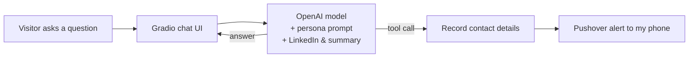

# 🤖 Career Twin Agent: Talk to My AI About My Career

**[▶ Try it live: twin-ihkk.onrender.com](https://twin-ihkk.onrender.com)**

> ⏳ Hosted on Render's free tier, so the app sleeps when nobody is using it. If the page is slow to load, give it up to 60 seconds to wake up.

## What is this?

Digital Twin is an AI chat agent that represents me, Eric Li. Recruiters and visitors can ask it about my background, skills and projects, and it answers in my voice, based on my LinkedIn profile and a personal summary I wrote.

If a visitor wants to get in touch and shares their email, the twin records it and sends a notification straight to my phone.

I built it as a hands-on project to learn how AI agents work: how to give a language model a persona, how to ground its answers in real documents, and how to let it call tools to take actions.

## Features

- 💬 **Answers career questions in my voice**: background, experience, technical skills and current projects
- 📄 **Grounded in real documents**: answers come from my LinkedIn profile (PDF) and a written summary, which reduces made-up answers
- 🛠️ **Tool use**: the model decides when to call Python functions, for example to record a visitor's contact details
- 📱 **Live phone alerts**: uses Pushover to notify me when someone leaves their email
- 🌐 **Deployed online**: runs as a public web app on Render, with automatic redeploys when I update the repo

## How it works



1. The visitor types a question in the Gradio chat interface.
2. The app sends it to the OpenAI model, together with a system prompt that sets my persona and includes the text of my LinkedIn PDF and summary.
3. The model either replies directly, or calls a tool (a Python function). For example, when a visitor shares their email, it calls a tool that sends me a push notification.
4. The reply appears in the chat.

## Tech stack

| Layer | Tool |
|---|---|
| Language | Python |
| AI model | OpenAI API (with tool calling) |
| User interface | Gradio |
| Document reading | PDF text extraction of my LinkedIn profile |
| Notifications | Pushover |
| Hosting | Render (free tier) |

## Project structure

```
career-twin-agent/
├── app.py            # Starts the Gradio chat app
├── context.py        # Builds the system prompt (persona + my documents)
├── tools.py          # Tools the model can call, e.g. record contact details
├── styles.py         # Custom look and feel for the chat UI
├── linkedin.pdf      # My LinkedIn profile, used as knowledge
├── summary.txt       # Short personal summary, used as knowledge
└── requirements.txt  # Python packages
```

## Run it yourself

1. **Clone the repo**
   ```bash
   git clone https://github.com/Ericli527/career-twin-agent.git
   cd career-twin-agent
   ```
2. **Install the packages**
   ```bash
   pip install -r requirements.txt
   ```
3. **Add your keys** in a `.env` file (never commit this file):
   ```
   OPENAI_API_KEY=your-openai-key
   PUSHOVER_USER=your-pushover-user
   PUSHOVER_TOKEN=your-pushover-token
   ```
4. **Make it yours**: replace `linkedin.pdf` and `summary.txt` with your own.
5. **Start the app**
   ```bash
   python app.py
   ```

To deploy on Render: create a Web Service from your repo, with build command `pip install -r requirements.txt` and start command `python app.py`, and add the keys above plus `GRADIO_SERVER_NAME=0.0.0.0` and `GRADIO_SERVER_PORT=10000` as environment variables.

## What I learned

- **Prompt design and grounding**: giving the model a clear persona and real source documents makes its answers much more accurate and on-brand.
- **Tool calling**: how a model chooses to call a function, and how to handle that call safely in code.
- **Deployment**: moving from a notebook-style project to a live web app, managing secrets with environment variables instead of hard-coding them.
- **Cost awareness**: keeping API usage cheap, with spending limits in place since the app is public.

## Acknowledgements

Built while following Ed Donner's AI agents engineering course, then customised with my own content, styling and deployment.

## About me

I'm Eric Li, an MSc Mathematical Finance graduate (University of York) with a BEng in Electronic Engineering (CUHK). I'm interested in finance data science and risk analytics, especially using AI to make financial services smarter.

🔗 [Connect with me on LinkedIn](https://www.linkedin.com/in/ericliuk0527/) · or just [ask my twin](https://twin-ihkk.onrender.com)!
